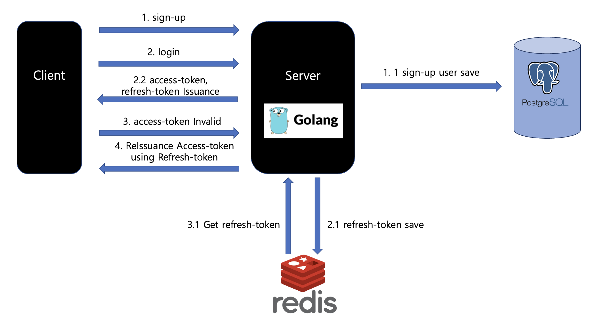

### Go로 구현한 JWT 인증 서버

| |  |
| --- | --- |
|언어| `Go` |
|DB | `postgresql`, `redis` |
|주요 라이브러리| `github.com/dgrijalva/jwt-go`   `github.com/gofiber/fiber/v2` `github.com/redis/go-redis/v9` `gorm.io/gorm`
 |
  
#### 주효 구현 기능
- `로그인`
  - access-token(20분), refresh-token(7일) 발급
  - refresh-token은 redis에 유저account를 key로, value로는 refresh-token 저장
  - 이때 redis 저장 수명을 refresh-token의 수명과 똑같이 지정하여 refresh-token 자동 삭제 기능 구현
  - cookie에 refresh-token 저장
- `토큰 검증 및 유효한지 검증`
- `토큰 재발급`
  - access-token 만료 시 cookie에 있는 refresh-token가져와서 access-token 재발급
  - 두 개의 토큰 모두 만료 시 재로그인 
- `로그아웃`
  - access-token을 key로 하고 value는 blackList로 둠으로써 로그아웃 유저 블랙리스트화
  - 만료시간이 0인 쿠키를 생성한 후 기존 쿠키로 오버랩하여 refresh-token 쿠키에서 삭제
---
### 심플 구조도

